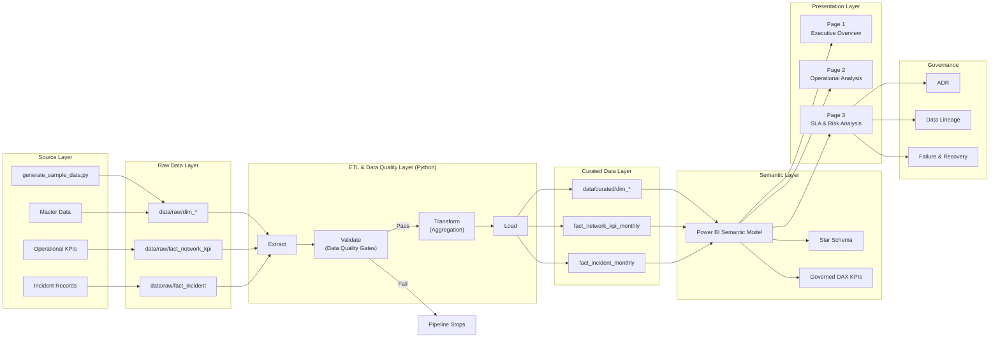

# Architecture — Telecom Network Analytics

##### Business Meaning of the ETL & Analytics Architecture Diagram

This diagram explains **how operational network data is transformed into trusted, decision-ready insights**, while protecting the business from incorrect or misleading information.

The architecture is designed not just for reporting, but for **reliable SLA governance, operational prioritization, and risk-based decision-making**.

## 1️⃣ Source Layer — *Where business reality originates*

**Business meaning:**
This layer represents the **real operational reality of a telecom network**.

* **Operational KPIs** reflect network performance signals such as uptime, downtime, and availability.
* **Incident Records** capture service disruptions that directly impact SLA compliance.
* **Master Data** defines the business structure (service, region, site, vendor).
* **`generate_sample_data.py`** acts as a portfolio-grade substitute for real OSS/NMS systems.

🎯 **Business value:**
Analytics starts from **operational facts**, not assumptions or dashboards.

---

## 2️⃣ Raw Data Layer — *Preserving the truth*

**Business meaning:**
The raw layer serves as an **immutable audit trail**.

* Data is stored exactly as received.
* No transformations or business logic are applied.

🎯 **Why this matters:**

* Any KPI can be traced back to its original source.
* Historical data can be reprocessed safely.
* Trust and compliance are preserved.

> *“We never overwrite reality.”*

---

## 3️⃣ ETL & Data Quality Layer — *Where trust is enforced*

This is the **most critical layer from a business perspective**.

### Extract

Data is ingested but **not yet trusted**.

### Validate (Data Quality Gates)

This is where **business go / no-go decisions** are made.

* Duplicate records at reporting grain → **STOP**
* Invalid or out-of-range values → **STOP**
* Missing business keys → **STOP**

📌 A stopped pipeline is **not a technical failure**,
it is a **business protection mechanism**.

> *“No data is better than wrong data.”*

---

### Transform (Aggregation)

Data is reshaped to match **how the business thinks**:

* Monthly reporting
* Service, region, and site perspectives

### Load

Only **validated and trusted data** is promoted forward.

---

## 4️⃣ Curated Data Layer — *Single Source of Truth*

**Business meaning:**
This layer represents the **official analytical dataset**.

* Clean
* Consistent
* Clearly defined reporting grain

🎯 **Organizational impact:**
All teams reference the same numbers, preventing:

* Conflicting KPIs
* Endless reconciliation discussions

---

## 5️⃣ Semantic Layer — *Where business logic lives*

This layer translates data into **business-understandable metrics**.

* **Star schema** ensures consistent aggregation.
* **Governed DAX measures** define SLA logic transparently.

🎯 **Key principle:**
SLA rules live in the **semantic layer**, not hard-coded in ETL, because:

* SLAs are business contracts
* Definitions may evolve over time

---

## 6️⃣ Presentation Layer — *Decision flow, not charts*

The three dashboard pages represent **three levels of decision-making**.

### Page 1 — Executive Overview

**Question answered:**

> *“Are we currently safe?”*

Focus:

* Awareness
* Status
* Headline indicators

---

### Page 2 — Operational Performance

**Question answered:**

> *“Where should we act first?”*

Focus:

* Severity vs frequency
* Service and site prioritization
* Actionable diagnostics

---

### Page 3 — SLA & Risk Analysis

**Question answered:**

> *“What is the risk if no action is taken?”*

Focus:

* Trends
* Breach duration
* Risk exposure

📌 The dashboard is designed as a **decision sequence**, not a static report.

---

## 7️⃣ Governance Layer — *Why this is enterprise-grade*

Governance artefacts are **foundational**, not optional.

* **ADR** explains *why* architectural decisions were made.
* **Data Lineage** shows *where numbers come from*.
* **Failure & Recovery Playbook** defines *what happens when things go wrong*.

🎯 **Business impact:**
Decisions become **defensible, auditable, and recoverable**.

---

## End-to-End Business Narrative (Executive Summary)

> This architecture shows how raw operational network data is safely transformed into trusted, decision-ready insights.
> By preserving raw data, enforcing data quality gates, and separating business logic into a governed semantic layer, the solution ensures that executive and operational decisions are based on accurate, explainable information.
> Governance artefacts provide traceability, accountability, and controlled recovery in the event of failure.

---

## Key Takeaway

This diagram is not about technology. It explains:

* **How the business trusts its data**
* **How SLA decisions are made**
* **How operational risk is identified before it becomes a breach**

---
