# Dashboard Wireframe — Telecom Network Analytics

## Business Meaning of the Dashboard Wireframe — Telecom Network Analytics

```mermaid
flowchart TB

%% ===== PAGE 1 =====
subgraph P1["PAGE&nbsp;1&nbsp;—&nbsp;Executive&nbsp;Overview"]
    T1["Title + Subtitle"]

    K1["KPI: Availability (%)"]
    K2["KPI: SLA Risk Status"]
    K3["KPI: Avg Downtime / Site"]
    K4["KPI: Incident Count"]

    C1["Trend: Availability & Services"]
    C2["Incident Trend"]
end

%% ===== PAGE 2 =====
subgraph P2["PAGE&nbsp;2&nbsp;—&nbsp;Operational&nbsp;Performance"]
    O1["Avg Downtime / Incident by Service"]
    O2["Avg Downtime / Site by Region"]
    O3["Incident Count VS Avg Downtime / Incident"]
    O4["Site-level Incident Impact Details"]
end

%% ===== PAGE 3 =====
subgraph P3["PAGE&nbsp;3&nbsp;—&nbsp;SLA&nbsp;&&nbsp;Risk&nbsp;Analysis"]
    R1["SLA Compliance Trend + SLA Line"]
    R2["SLA Gap by Service"]
    R3["SLA Breach Duration by Service"]
    R4["SLA Risk Exposure Matrix"]
end

%% ===== FLOW =====
T1 --> K1
T1 --> K2
T1 --> K3
T1 --> K4

K1 --> C1
K2 --> C1
C1 --> C2

P1 --> P2
P2 --> P3

```



This dashboard wireframe is **not merely a visual layout**, but a representation of a **business decision flow** from executive awareness to operational diagnosis and SLA risk management.

The dashboard is intentionally designed in **layers**, ensuring users are guided logically from **status → diagnosis → risk**, rather than jumping directly into details without context.

---

## Overall Business Flow

At a high level, the dashboard follows this decision sequence:

> **Awareness → Diagnosis → Risk-Based Decision**

In telecom terms:

> **“Are services safe?” → “Where are the problems?” → “What is the risk if no action is taken?”**

This reflects a **professional analytics design pattern**, not traditional static reporting.

---

## PAGE 1 — Executive Overview

### *Purpose: Awareness & Status*

### Business Meaning

Page 1 answers the **primary executive question**:

> **“What is the current health of the network?”**

Key elements on Page 1:

* **Title + Subtitle**
  Provides business context (time period, service scope, dashboard intent).

* **KPI Cards**

  * Availability (%)
  * SLA Risk Status
  * Avg Downtime per Site
  * Incident Count

  These KPIs are selected to:

  * Enable **at-a-glance understanding**
  * Translate technical performance into **business-readable signals**

* **Trend: Availability & Services**
  Shows whether performance is:

  * Stable
  * Improving
  * Degrading relative to SLA

* **Incident Trend**
  Adds context on whether disruptions are:

  * Isolated events
  * Or part of a growing pattern

### Key Insight

* No site-level or deep technical detail is exposed
* The goal is **situational awareness**, not root-cause analysis

📌 **Page 1 is designed to confirm whether a problem exists, not to investigate it.**

---

## PAGE 2 — Operational Performance

### *Purpose: Diagnosis & Prioritization*

### Business Meaning

Page 2 addresses the operational question:

> **“If there is a problem, where should we act first?”**

Key elements on Page 2:

* **Avg Downtime per Incident by Service**
  Focuses on **severity per incident**, not just incident volume.

* **Avg Downtime per Site by Region**
  Highlights geographic areas with the highest operational impact.

* **Incident Count vs Avg Downtime per Incident**
  Combines:

  * **Frequency** (how often incidents occur)
  * **Severity** (how impactful they are)

  This distinction helps differentiate between:

  * Many low-impact incidents
  * Fewer but high-impact incidents

* **Site-level Incident Impact Details**
  Functions as an **action-oriented list**, enabling teams to:

  * Identify priority sites
  * Act based on impact, not intuition

### Key Insight

📌 Page 2 bridges the gap between **insight and action**.
Without it, leadership may know a problem exists but lack clarity on where to intervene.

---

## PAGE 3 — SLA & Risk Analysis

### *Purpose: Risk Awareness & Strategic Decision-Making*

### Business Meaning

Page 3 answers the strategic question:

> **“What is the business risk if the current situation continues?”**

Key elements on Page 3:

* **SLA Compliance Trend + SLA Line**
  Visualizes performance relative to the SLA target over time.

* **SLA Gap by Service**
  Identifies services that are:

  * Closest to breaching SLA
  * Already operating in a risk zone

* **SLA Breach Duration by Service**
  Focuses on **how long SLA breaches persist**, not just their magnitude.

* **SLA Risk Exposure Matrix**
  Combines:

  * Severity (SLA gap)
  * Duration (time below SLA)
  * Frequency (incident occurrence)

  This matrix enables **risk-based prioritization**, not assumption-driven decisions.

### Key Insight

📌 Page 3 translates technical performance issues into **business risk that leadership can act upon**.

---

## Meaning of the Page-to-Page Flow

The flow in the diagram shows:

```
PAGE 1 → PAGE 2 → PAGE 3
```

This implies:

* Not all users need to consume every page
* Executives may stop at Page 1
* Operations and management teams proceed to Pages 2 and 3 as needed

📌 This reflects **role-based analytics consumption**.

---

## End-to-End Business Narrative (Concise)

> This dashboard is designed to guide decision-making progressively.
> It begins with a high-level view of service health, moves into operational diagnosis to determine action priorities, and concludes with SLA risk analysis to support strategic decisions.
> Through this structure, data is not merely observed, but actively used to manage network performance and business risk.

---
