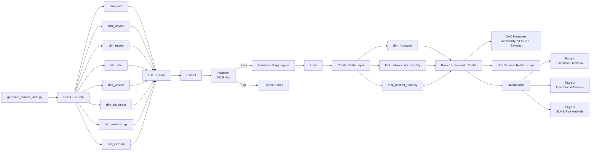

# Data Lineage — Telecom Network Analytics

## 1. Purpose & Scope

This document describes the **end-to-end data lineage** for the Telecom Network and Operational Analytics solution.

The purpose of this document is to:

- Provide full traceability from **raw data generation** to **executive dashboards**
- Explain how data flows through **ETL, validation, transformation, and semantic layers**
- Support **data governance, auditability, and architectural transparency**

The lineage covers:

- Dimension and fact data
- ETL processing and data quality gates
- KPI and SLA metric derivation
- Dashboard consumption (Page 1–3)

---

## 2. High-Level Data Lineage Diagram

---

## 3. Source Layer

### Description

The **Source Layer** represents the origin of all analytical data.

In this project, data is generated programmatically to simulate  **realistic telecom operational systems** .

### Source Component

* `scripts/generate_sample_data.py`

### Source Data Outputs (Raw CSV)

* Dimensions:
  * `dim_date.csv`
  * `dim_service.csv`
  * `dim_region.csv`
  * `dim_site.csv`
  * `dim_vendor.csv`
  * `dim_sla_target.csv`
* Facts:
  * `fact_network_kpi.csv`
  * `fact_incident.csv`

### Key Characteristics

* Append-only
* No transformations
* No data quality enforcement
* Serves as immutable raw input

---

## 4. ETL & Data Quality Layer

### Description

The **Source Layer** represents the origin of all analytical data.

In this project, data is generated programmatically to simulate  **realistic telecom operational systems** .

### Source Component

* `scripts/generate_sample_data.py`

### Source Data Outputs (Raw CSV)

* Dimensions:
  * `dim_date.csv`
  * `dim_service.csv`
  * `dim_region.csv`
  * `dim_site.csv`
  * `dim_vendor.csv`
  * `dim_sla_target.csv`
* Facts:
  * `fact_network_kpi.csv`
  * `fact_incident.csv`

### Key Characteristics

* Append-only
* No transformations
* No data quality enforcement
* Serves as immutable raw input

---

## 5. Curated & Semantic Layer

### Entry Point

* `orchestration/main.py`

### ETL Modules

* `etl/extract.py`
  * Reads raw CSV files
* `etl/validate.py`
  * Enforces data quality gates:
    * Schema validation
    * Null checks on business keys
    * Duplicate detection at reporting grain
    * Value range validation
* `etl/transform.py`
  * Aggregates data to reporting grain
  * Prepares base metrics (uptime, downtime)
* `etl/load.py`
  * Writes validated outputs to curated layer

### Data Quality Principle

 **Fail-fast enforcement** :

* If validation fails → pipeline stops
* No downstream data is produced

---

## 6. Semantic & KPI Layer (Power BI)

### Semantic Model

* Star schema
* Fact-to-dimension relationships:
  * Date
  * Service
  * Region
  * Site
  * Vendor

(Refer to diagrams in [star schema diagram](../architecture/image/Star_Schema_Snow_Flake_Diagram.png) and [ERD Diagram.](../architecture/image/ERD_Diagram.jpg)

### KPI & Measure Derivation (DAX)

Key measures are defined in Power BI to ensure:

* Transparency
* Business ownership
* Flexibility

Examples:

* Availability (%)
* SLA Gap (bps)
* Avg Downtime per Incident
* Incident Count
* Days Below SLA
* Incident Trend (Last 3 Months)

📌 KPI logic is intentionally  **not hard-coded in ETL** .

---

## 7. Presentation & Consumption Layer

### Dashboards

The semantic layer feeds three analytical dashboard pages:

* **Page 1 — Executive Overview**
  * High-level service health
  * SLA headline indicators
* **Page 2 — Operational Performance Analysis**
  * Incident severity and frequency
  * Service, region, and site-level diagnostics
* **Page 3 — SLA & Risk Analysis**
  * SLA compliance trends
  * Breach duration
  * Risk exposure matrix

### Consumption Characteristics

* Single governed semantic model
* Consistent KPIs across all pages
* Role-based analytical depth

---

## 8. Governance, Documentation & Traceability

### Documentation Assets

* `docs/PROJECT_OVERVIEW.md`
* `docs/architecture/Architecture_Decisions_Record.md`
* `docs/storytelling/STORYTELLING_SUMMARY.md`

### Governance Principles

* Full lineage traceability
* Version-controlled documentation
* Explicit architectural decisions (ADR)
* Clear ownership of data transformations and KPIs

---

## 9. Summary

This data lineage ensures that:

* Every dashboard metric can be traced back to its raw source
* Data quality issues are caught before reaching business users
* SLA and operational decisions are based on governed, explainable data

> **The lineage reflects production-inspired analytics engineering practices, designed for reliability, transparency, and decision impact.**
