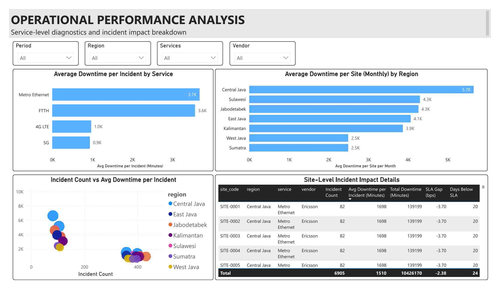
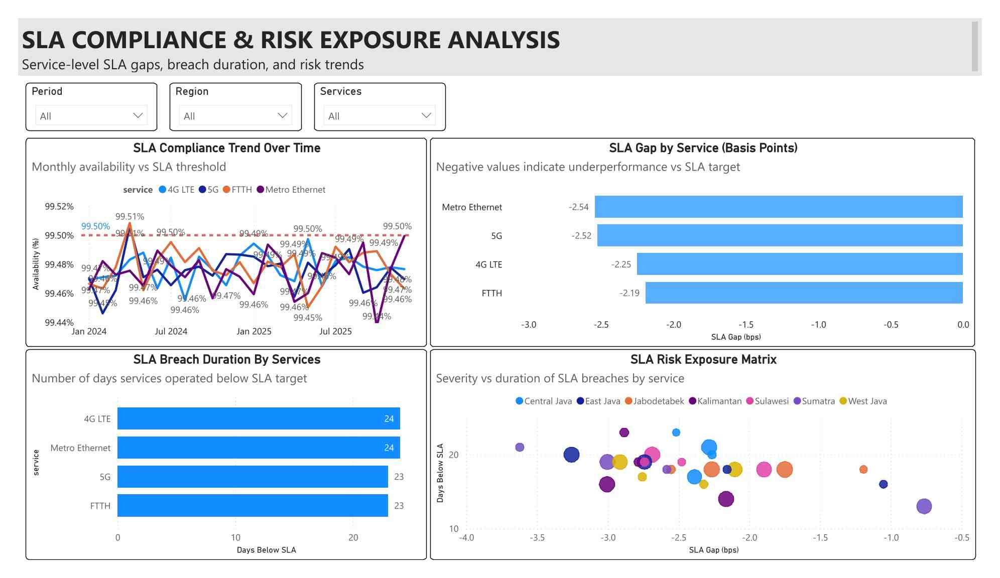

# 📘 STORYTELLING SUMMARY  
## Network Performance Analysis

---

## PAGE 1 — EXECUTIVE OVERVIEW  
### Executive-Level Network Performance Snapshot

### 🎯 Objective
Provide management with a rapid and comprehensive view of overall network health, while identifying potential SLA risks that require further attention.

---

### 📊 Executive Narrative

At an aggregate level, **network availability remains close to the SLA target**, indicating that services are generally operating in a stable condition. The Availability (%) KPI provides an initial signal that the network is not currently in a critical state.

However, supporting indicators show that **the safety margin against the SLA is narrowing**. This is reflected in the **SLA Gap (%)** and **Availability Trend (Last 3 Months)**, which suggest a potential performance decline if no preventive actions are taken.

The **Average Downtime per Site** KPI reveals that although overall availability appears healthy, **downtime impact at the site level remains significant**. Tooltips such as **P95 Downtime** and **% Sites Exceeding Downtime Threshold** indicate that a subset of sites experiences downtime beyond acceptable operational limits.

**Incident Count** provides additional context regarding operational workload. Tooltips like **Incidents per 100 Sites** and **Average Downtime per Incident** help distinguish between high-volume, low-impact disruptions and fewer but high-impact incidents that pose greater business risk.

The **Availability by Services** visualization highlights that service stability is not uniform across all offerings, with certain services showing more vulnerable trends. The **Incident Trend** chart complements this by illustrating how disruption patterns evolve over time.

---

### 🔍 Key Insight — Page 1
> **The network remains stable at an aggregate level, but early warning signals indicate emerging SLA risk due to a narrowing safety margin and uneven downtime impact.**

---

### 💼 Business Impact — Page 1
- Risk of rapid transition from *ON TRACK* to *AT RISK* or *BREACH*
- Potential customer escalation driven by recurring disruptions at specific sites
- Increased operational burden if priorities are not clearly defined

---

### ✅ Decision & Action Recommendation — Page 1
- Classify overall network status as **“Stable but At Risk”**
- Activate **early warning monitoring** based on performance trends and SLA gaps
- Proceed to deeper operational analysis to identify primary risk drivers

➡️ *Analysis continues to Page 2 — Operational Analysis.*

---

## PAGE 2 — OPERATIONAL ANALYSIS  
### Service & Site-Level Incident Impact Diagnostics

### 🎯 Objective
Identify the primary sources of operational disruptions and establish handling priorities based on **severity and impact**, rather than incident volume alone.

---

### ⚙️ Operational Narrative

The analysis begins with **Average Downtime per Incident by Service**, revealing that not all services experience disruptions in the same way. Some services may have fewer incidents, but each incident results in substantially higher downtime.

The **Average Downtime per Site (Monthly) by Region** visualization exposes the geographic concentration of impact. Tooltips such as **Incident Trend (Last 3 Months)** and **SLA Gap (bps)** help differentiate between temporary fluctuations and recurring structural issues.

The **Incident Count vs. Average Downtime per Incident** scatter chart combines frequency and severity dimensions to distinguish:
- High-frequency, low-impact incidents
- Low-frequency, high-impact incidents, which represent the greatest business risk

The **Site-Level Incident Impact Details** table serves as an *action layer*, enabling operational teams to identify priority sites based on total downtime, SLA gap, and breach duration.

---

### 🔍 Key Insight — Page 2
> **SLA risk and customer impact are primarily driven by incident severity concentrated within specific services and sites.**

---

### 💼 Business Impact — Page 2
- Incident handling without impact-based prioritization increases OPEX
- Prolonged downtime at critical sites degrades customer experience
- Misaligned focus can extend overall SLA risk exposure

---

### ✅ Decision & Action Recommendation — Page 2
- Reprioritize incident handling based on **Average Downtime per Incident** and **Total Downtime**
- Focus corrective actions on sites with the highest operational impact
- Use this analysis as the basis for vendor escalation and internal performance review

➡️ *Analysis continues to Page 3 — SLA & Risk Analysis.*

---

## PAGE 3 — SLA & RISK ANALYSIS  
### SLA Compliance, Breach Duration & Risk Exposure

### 🎯 Objective
Translate operational performance into **SLA risk exposure** with direct implications for contracts, reputation, and business sustainability.

---

### 📈 Strategic Narrative

The **SLA Compliance Trend Over Time** visualization illustrates how availability evolves relative to the SLA target, helping identify latent risks that develop gradually rather than abruptly.

**SLA Gap by Service (bps)** highlights small but contractually meaningful deviations. Presenting the gap in basis points enables management to detect risks that may not be obvious when expressed as percentages.

The **SLA Breach Duration by Service** chart emphasizes that breach duration is as critical as breach magnitude, often signaling structural issues rather than short-term anomalies.

The **SLA Risk Exposure Matrix** combines three key risk dimensions:
- **Severity** (SLA Gap)
- **Duration** (Days Below SLA)
- **Frequency** (Incident Count)

This visualization clearly identifies services with the highest overall SLA risk exposure requiring strategic intervention.

---

### 🔍 Key Insight — Page 3
> **SLA risk is defined by the combined effect of deviation magnitude, breach duration, and incident frequency—not by a single metric alone.**

---

### 💼 Business Impact — Page 3
- Potential SLA penalties driven by repeated or prolonged breaches
- Erosion of customer trust and service reputation
- Increased likelihood of contractual escalation and regulatory scrutiny

---

### ✅ Decision & Action Recommendation — Page 3
- Classify services into **SLA Risk Tiers (Low / Medium / High)**
- Initiate immediate intervention for services with extended breach durations
- Use this analysis to support vendor escalation and justify targeted improvement investments

---

## 🔚  CONCLUSION

> **While overall network performance remains under control, the analysis reveals significant SLA risk exposure concentrated in specific services and sites. Without targeted action, these risks may escalate into SLA breaches with direct business consequences.**
